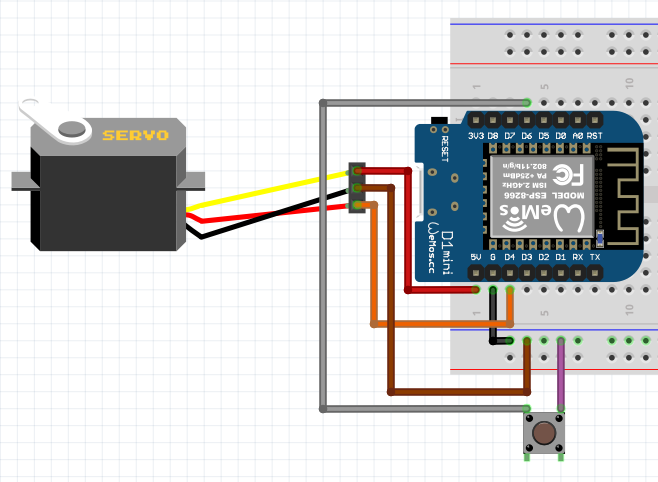
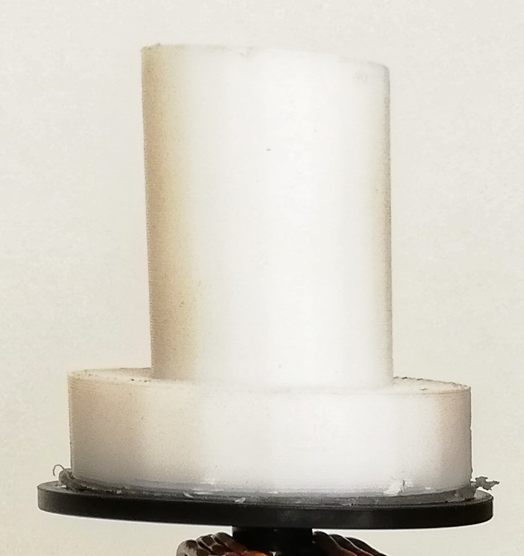

# Insert Project title

This project were made for the educational programming class "Programming Interactive Experiences" as part of Computer Science & Informatics, hence the name.

***

## Vision 
The projects vision is to create "seamless" way to unlock your door through you mobile phone, purely based on it's presence.

If you like me, have keys for many houses or buildings, then your set of keys can become quite huge and heavy, and bothersom to carry around.
Hence it would be nice if any door you come near, simply unlocks for you, either on it's own *( yes magic exicsts, its called science )*, or by clicking a button, eliminating the need for you to fumble with a half hundred keys, to find the right one, as well as having to carry the keys arond in the first place.

I will show you, how I have managed to make a **prototype** of this magical wonder.
If you wonna see how the end result looks like, then click **[HERE](#end-result)**

***

## What you need
To follow what I have done, you'll be needing the following

* 1 breadboard                - I'll be using & suggest a board between 10-30
* 1 Wemos with a Wi-Fi chip   - I'll be using a model "ESP 8266" ( the important part is Wi-Fi capabilities)
* 1 Servo + it's moutings     - I'll be using a model "Tower Pro MG995 - Digi HI-Speed"
* 1 Button                    - Clickedy click
* 6-8 cables                  - I'll let you pick your own colours. I'll be using 2 red, 2 brown, 1 orange, 1 purple, 1 grey & 1 black
* Acces to a gluegun
* Access to a laser cutter    - Pew Pew \*laser gun noise\*
* Access to box material      - I'll be using 3mm wood
* Access to a 3D printer      - A small one, one that can print 5x5cm
* Access to a sodder station  - I'll be asuming that you know how to sodder
* Access to a drill           - Either hand or stationary should do
* Access to [makercase.com](http://www.makercase.com/) - To design your own case
* Access to Arduino

***

### Setting up
- Breadboard, wemos, servo, button and cables
This is what you should aim for in this section

##### Disclaimer
 - Your servo, as well as my own, will not look like the one on the picture, it is simply there to illustrate, as there is not one who looks like the one we are going to use, in the [Fritzing](http://fritzing.org/home/) program which I used to make the schematic. That also means that the servo'scable colors does not match entirely with reality.
Hopefully any confusion cause by this, will go away when pictures of the real prototype comes into play.

I'll start by explaning the cables, and their usage.
(bear in mind that on the picture, there is only shown 6 cables attached to the breadboard, though I said we would need 8, this is not a mistake, and I will explain why later)

Black cable -> The black cable is a ground extension cable. It allows for conversion of 1 ground (G) pin into a row of ground pins. All pins in the same row as the black, and continued down along the side of the wemos, becomes ground, this is necessary because we need a ground for both our servo, and our button.

Red cable -> The red cable is the power cable, going from the 5V (5 Volt) pin on wemos to the servos red cable.
Giving the servo electrical power.

Brown cable -> The brown cable is the ground cable, going from the 2nd most outer nr. 4 pin, to the servos brown.

Orange cable -> The orange cable is the signal cable, going from the D4 pin (Wemos D4), to the servos orange.
*( If you stop here, you'll be having a working servo )*

Purple cable -> The purple cable is the ground, going from the 2nd most outer nr. 6 pin, to the buttons NO "pin".

Grey cable -> The grey cable is the signal, going from the D6 pin (Wemos D6), to the nuttons C "pin". 
*( Now both your servo, and button should be working )*

#### The interface between lock and servo
With your servo you'll most likely have gotten a small back of different kinds of attachments, small plates and arms, as well as screws and rubber disks, I have used the biggest one that came with it, for creating one of the core parts in the project, and the way that the servo can turn the locking bolt.

The 3D printed mounting device, which holds onto the locking bolt, and connects the servo, turning the servos rotation into an action that can unlock a door.
I've glued it onto the black disk which sits/grips onto the head of the servo.
Get the center of the disk and the center of your locking mount, to be synchronised for the best, and smoothes performance.
If it's a little off, it won't ruin everything.

Your bolt might differ from my own, so you'll have to do your own measurement and modeling to get it right.
But here is a picture of my solution.
[Locking mount image](#locking-mount)

***

### Code
If you have some experience with programming, most of this code will probably be self-explanatory for you, but if you don't, then fear not, I've commented my part of the code, to a degree that I believe make it understandable to everyone, with just a slight experience with programming.
I suggest a reading of the files in the following order:
 * [Functions.ino](main/functions.ino)
 * [Defines.h](main/defines.h)
 * [Main.ino](main/main.ino)
 * [Sniffer.ino](main/sniffer.ino)

### End result

**[Back to the top](#vision)**

### Locking mount

